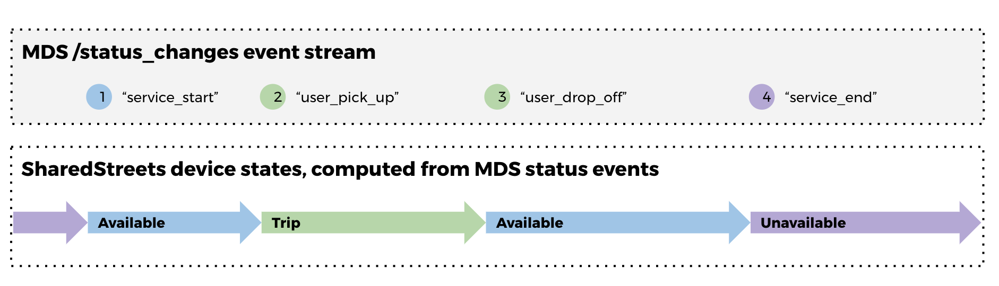
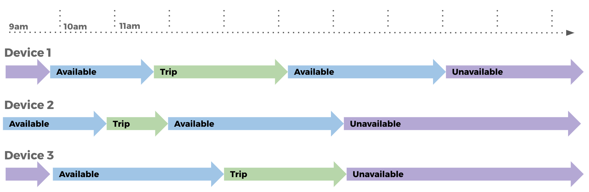
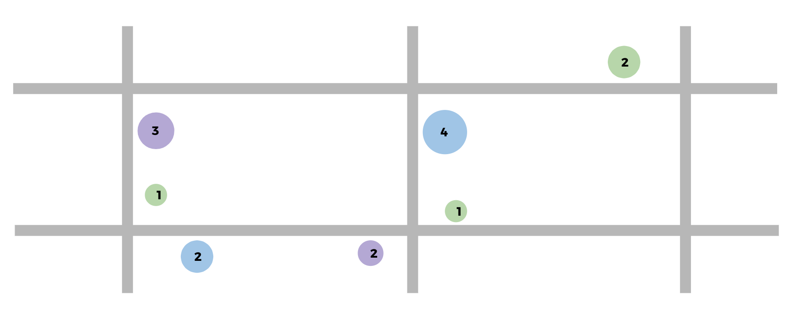
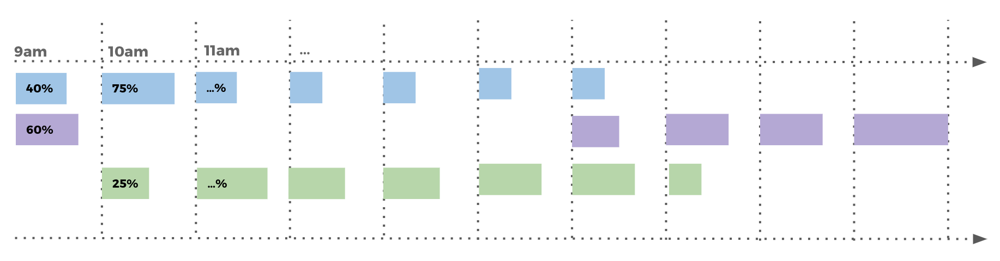
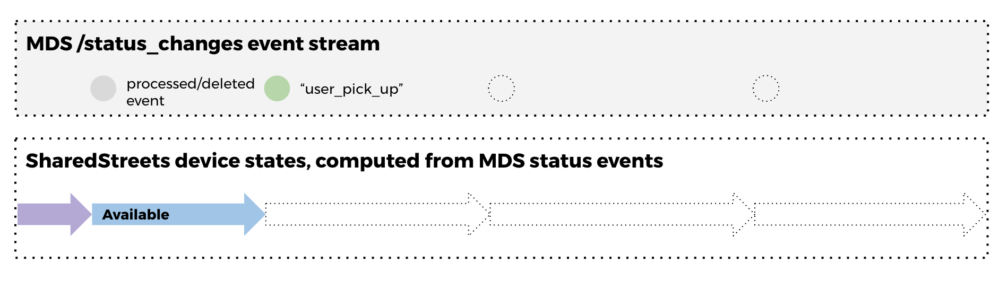
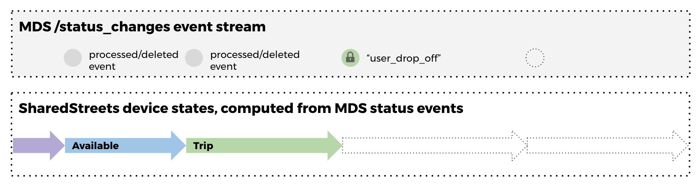
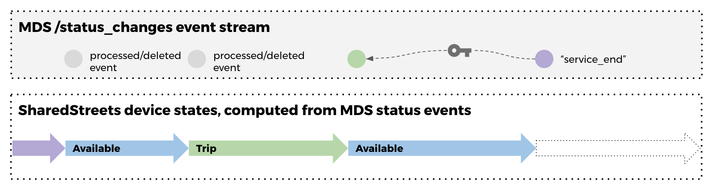

## MDS + SharedStreets Data Processing Pipeline

This project provides a series of tools for collecting, processing, and interpreting ["Micromobility Data Specification" (MDS)](https://github.com/CityOfLosAngeles/mobility-data-specification) formatted data streams using SharedStreet analysis and aggregation methods. These tools are designed to minimize privacy/re-identification risks inherent in working with citizen-generated movement data, and improve the quality and consistency of derived analysis. 

The project addresses the following challenges in working with MDS data:

- MDS provides event-based data streams that require additional, at times complex, processing steps to determine the historical and real-time state of mobility services, and related performance metrics.
 
- Generation of metrics involves processing historical event sequence (MDS "status changes" and "trips") and requires caching data containing sensitive citizen-generated, re-identifiable travel information.



These tools are built on the theory that most metrics used for planning and oversight applications are more useful when spatially and temporally aggregated, and that aggregation also provides solutions for addressing data privacy and data management challenges.

**Aggregation is a three step process:**

1. Convert event streams (e.g. *user drop off*) to vehicle states (e.g. *vehicle available*), while minimizing storage of historical state data, and encrypting any cached data while at rest.


2. Aggregate vehicle states using well known street/spatial zone representations (e.g. linear [SharedStreets IDs](https://github.com/sharedstreets/sharedstreets-ref-system) or [H3 zones](https://uber.github.io/h3/))


3. Further aggregate spatially grouped data using standardized temporal aggregation methods (e.g. available vehicles grouped by SharedStreets segment ID and hour of week)



This project provides a pluggable architecture for adding new MDS provider data sources, and for creating new metrics derived from event streams. All code and related tools are made available as open source (under and MIT license) and can be deployed by cities and local governments as a way to manage their MDS data collection process, or by mobility operators or developers of analysis software.

### Getting started

1. ```yarn install ```

2. Run ```server.ts``` to run data collector and API end point. 

### Technical Details

#### Safely processing event streams

The SharedStreets aggregation tools provide methods for processing historical and real-time streams of MDS event data, while minimizing the data that is kept by the processor. These tools store only the last processed event, required for generating state transitions when future events are collected. Historical state data is discarded once used, however, a hashed signature of each event is kept to ensure the event is not accidentally  re-processed in future queries to the MDS data stream.

**State 1:** most recent event is kept for each device

**State 2:** 
previous "pick up" event used to process "available" state and discarded


The SharedStreets tools provide an additional layer of protection by encrypting temporarily cached state data. The encrypted records can only be read by a user with access to data contained in future event records generated from the same device and MDS data stream.

**Encrypting state data:** most recent cached event is encrypted

**Decrypting state data:** cached events can only be decrypted using data contained in a future event from the same vehicle
 
